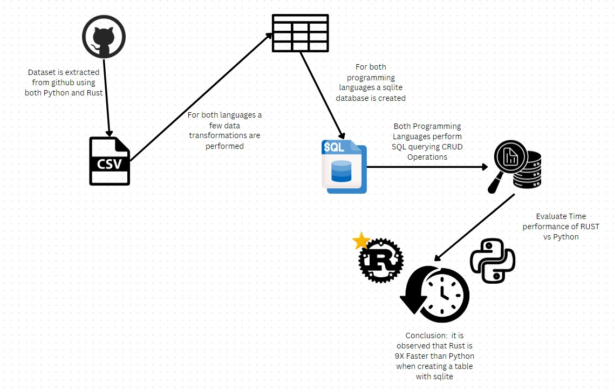

# chris_moreira_project_week_5
# Status Badge for Sucessful Run

# File Structure 
-- Devcontainer Directory -- 
- Dockerfile: reates a development container based on a Microsoft VS Code image, installs Python and GCC, sets up a virtual environment, and installs dependencies from requirements
- devcontainer.json: configures the development environment within a container, specifying settings like the base image, extensions, and other dependencies needed for a consistent and reproducible coding experience.

-- .github/workflows Directory --
  - cicd.yml: defines the configuration for the (CI/CD) processes, specifying the steps and conditions for automating code builds, tests, and deployments.

-- data Directory --
  - Spotify_Most_Streamed_Songs.csv: Dataset used in this project

-- mylib Directory --
  - __init__.py
  - extract.py: Extracts data from csv file
  - query.py: Performs all 4 operations in this peoject (CRUD)
  - transform_load.py: Loads data form csv file into SpotifyDB.db dattabase

 -- Main Directory --
 - SpotifyDB.db: Database generated by the load function in mylib
 - Dockerfile.json: This Dockerfile creates an Alpine-based container, installs Bash, and copies repeat.sh to the /app directory.
 - main.py: calls all fucntions defined in my lib and runs them performing the CRUD operation in this assignment
 - requirenments.txt: Specify the library requirenments for this project
 - setup.sh: shell that automates the installation and configuration of software or environment settings for this project
 - test_main.py : Tests the functions called in main.py
      

# Project Purpose
In this project we import a csv file to first form a SQL database from its data structure. Second, we query this databse performing the sqlite CRUD operations which stand for CREATE, READ, UPDATE, DELETE functions. The functions are then called, tested and imported into this main directory. The project folows the cicd framework, and all requirenments for the key operations and fucntion to run are specified. 

# Data Flow map for this project

