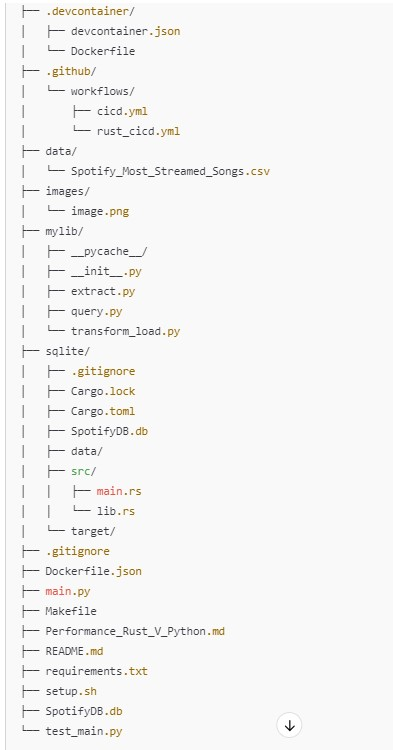

# Rust Vs. Python Perofrmance Project
# Status Badge for Sucessful Run
[](https://github.com/nogibjj/chris_moreira_week_8_Rust_v_Python/actions/workflows/cicd.yml)
[](https://github.com/nogibjj/chris_moreira_week_8_Rust_v_Python/actions/workflows/rust_cicd.yml)
# File Structure 



# Project Purpose
This project produces a sqlite database in two different avenues: one is by running a Python Script, other is by running a Rust script. In a nutshell, both scripts perform the exact same task. 

In the project a dataset containing Spotify's top played songs is imported from Github and extracted. 
Then a databse SpotifyDB.db is created. 
Finally a few simple query operations are performed using sqlite (CREATE, READ, UPDATE, DELETE). Please refer to the Data Flow schema below to evaluate the flow of data in this project.


This project runs an experiment: how can RUST improve the time performance of an operation? 

Please refer to the file Performance Rust_V_Python to see the time improvement experiment from rust. 

Note in the main.rs file and main.py file we calculate the time it takes for:
1. Run a Create Function is Rust: The table creation took approximately 725.3 microseconds (or 0.0007253 seconds).
2. Run a Create Fucntion in Python: The table creation took approximately 0.0065 seconds (or 6.5 milliseconds).

As a conclusion, it was observed that Rust is 9X more efficient than Python when running a CREATE function. 

Here are a few operations to make this peoject compatible with rust -- 
```bash
#Build the project
cargo build

# Run the project
cargo run

# Make A new project
cargo new

```
# Data Flow map for this Project Experiment

